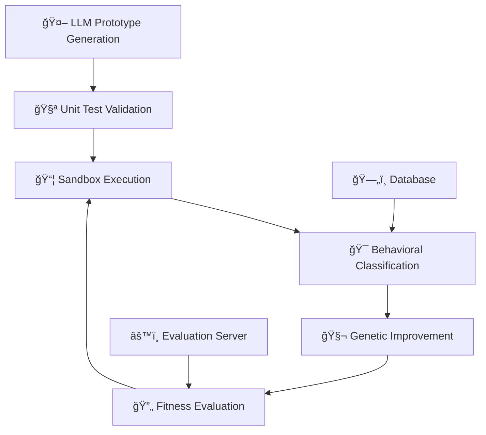

# 🧬 GIMC - Genetically Improved Malicious Code

[](https://github.com/schladt/GIMC)
[](LICENSE)
[](https://python.org)
[](https://pytorch.org)

> **Advancing malware research through AI-driven genetic improvement and behavioral analysis**

## 🎯 Project Overview

GIMC addresses a fundamental challenge in cybersecurity research: **how do we understand and defend (through reconstruction) against malware procedures when source code and binaries are unavailable?** This project combines Large Language Models (LLMs), Genetic Improvement (GI), and advanced behavioral analysis to generate, evolve, and classify malware-like behaviors for defensive research.

### 🔬 Research Innovation

GIMC introduces a novel approach that:
- **🤖 Generates** functionally equivalent, syntactically diverse code prototypes using LLMs
- **🧪 Evolves** these prototypes through genetic improvement to match specific malware behaviors  
- **📊 Classifies** implementations using ML models trained on dynamic analysis telemetry
- **🔄 Iterates** through adversarial training between generator and discriminator components

### 🎓 Academic Context

This framework supports cybersecurity research by enabling:
- **Data Augmentation**: Generate synthetic malware behaviors for detection pipeline training
- **Threat Modeling**: Create procedure-level emulations for blue-team validation
- **Behavioral Analysis**: Understand implementation diversity within malware families
- **Anticipatory Defense**: Explore likely-future variants before they appear in the wild

## 🏗️ System Architecture



## 📁 Project Components

### 🤖 [Classifier](./classifier/) - NLP-Based Malware Classification
Advanced machine learning models that classify malware families using dynamic analysis reports as natural language text.

**Key Features:**
- Multiple neural architectures (MLP, CNN, LSTM, Transformer/BERT)
- State-of-the-art NLP techniques for behavioral pattern recognition
- Multi-family classification with extensible framework
- Comprehensive evaluation and metrics comparison

**Models Available:**
- **MLP**: Fast baseline classification
- **CNN**: N-gram pattern detection  
- **LSTM**: Sequential behavior analysis
- **BERT/Transformer**: Advanced contextual understanding

### 🧬 [Genetic Improvement (GI)](./gi/) - Code Evolution Engine
AST-based genetic algorithms that evolve code prototypes to match target behavioral signatures.

**Key Features:**
- AST-level code manipulation using srcML
- Composite fitness evaluation (compile + tests + behavioral score)
- Multi-stage evaluation pipeline with surrogate scoring
- High-throughput evolution with parallelization support

### 📦 [Sandbox](./sandbox/) - High-Throughput Dynamic Analysis
Lightweight, scalable malware analysis sandbox designed for massive behavioral evaluation loops.

**Key Features:**
- High-throughput execution (~19.58s/sample average)
- Multi-VM orchestration (VMware/libvirt support)
- Standardized telemetry collection (Procmon + Sysmon)
- Isolated execution environment with snapshot restoration
- RESTful API for automated sample submission

**Sandbox Stats:**
- Processed 30,221+ analyses in research validation
- Supports 12+ concurrent Windows 10 VMs
- Configurable VM pools and analysis timeouts

### 🔬 [Prototypes](./prototypes/) - Research Components  
Experimental code and proof-of-concept implementations for various GIMC research objectives.

**Research Areas:**
- LLM prompt engineering for malware procedure generation
- Unit test frameworks for TTP validation
- Behavioral analysis utilities and telemetry processing
- Fitness function development and optimization

## 🚀 Quick Start

### Prerequisites

```bash
# Python 3.8+ with pip
pip install -r requirements.txt

# Additional ML dependencies
pip install torch torchvision
pip install transformers tokenizers
```

### Configuration

Create `settings.json` in the project root:

```json
{
    "openai_api_key": "{{ YOUR OPENAI API KEY }}",
    "data_path": "/path/to/your/data/",
    "sqlalchemy_database_uri": "{{ YOUR DATABASE CONNECTION STRING }}",
    "sandbox_token": "{{ YOUR SECRET TOKEN }}",
    "srcml_client": "/path/to/srcML/bin/srcml",
    "sandbox_url": "http://127.0.0.1:5000",
    "evaluation_server": "http://127.0.0.1:5090"
}
```

### Component Setup

1. **🏃‍♂️ Start the Sandbox**:
```bash
cd sandbox/
python run.py 0.0.0.0 5000
```

2. **🤖 Train a Classifier**:
```bash
cd classifier/
jupyter notebook mlp4mal.ipynb
```

3. **🧬 Run Genetic Improvement**:
```bash
cd gi/
python gi_demo.ipynb
```

## 📊 Research Results

### 🎯 Classification Performance
- **Binary Classification**: 100% validation accuracy (DFS vs BFS traversal)
- **Multi-class**: 100% validation accuracy by epoch 11 (3-class problem)
- **Training Time**: ~26 minutes (binary), ~239 minutes (3-class) on RTX 3080

### 🧬 Evolution Efficiency  
- **LLM Success Rate**: ~25% of requests yield passing implementations
- **Genetic Convergence**: 100 unique optimal solutions by generation 60
- **Surrogate Speed**: ~60× faster than full behavioral evaluation
- **Scalability**: ~2.4 hours for full analysis with 10× parallelization

### 📦 Sandbox Throughput
- **Processing Rate**: 30,221 analyses over 98.6 hours
- **Average Runtime**: ~19.58 seconds per sample
- **VM Configuration**: 12 Windows 10 VMs on single Ubuntu host (i9-10850K, 128GB RAM)

## 📈 Applications & Impact

### 🛡️ Defensive Research
- **Detection Enhancement**: Generate diverse training data for ML-based malware detectors
- **Threat Intelligence**: Understand procedural variations within malware families
- **Red Team Exercises**: Create realistic adversarial scenarios for security validation

### 🔍 Academic Research
- **Behavioral Analysis**: Study implementation diversity in malicious code
- **ML Security**: Explore adversarial examples in cybersecurity contexts  
- **Code Generation**: Advance AI-assisted programming for security applications

### 🚀 Future Work
- **Larger Scale**: Expand to enterprise-grade malware families and TTP coverage
- **Real-time Integration**: Deploy in live threat hunting and incident response
- **Collaborative Defense**: Share synthetic signatures across security organizations

## 🛠️ Technical Stack

| Component | Technology | Purpose |
|-----------|------------|---------|
| **🤖 ML/AI** | PyTorch, Transformers, scikit-learn | Model training and inference |
| **🧬 Code Analysis** | srcML, AST manipulation | Genetic code modification |
| **📦 Virtualization** | libvirt, VMware | Sandbox environment management |
| **🗄️ Data** | PostgreSQL, SQLAlchemy | Persistent storage and ORM |
| **🌐 APIs** | Flask, RESTful services | System integration and control |
| **📊 Analysis** | Sysmon, Process Monitor | Dynamic behavior collection |

## 📚 Documentation

- 📖 **[Classifier README](./classifier/README.md)**: Detailed NLP model documentation
- 📦 **[Sandbox README](./sandbox/README.md)**: Complete sandbox setup and usage guide  
- 🧬 **[GI Documentation](./gi/)**: Genetic improvement algorithms and fitness functions
- 🔬 **[Research Prototypes](./prototypes/)**: Experimental code and proof-of-concepts

## ⚠️ Research Ethics & Safety

**This project is designed for defensive cybersecurity research only.** All generated code is:
- 🔒 Executed in isolated sandbox environments
- 🎓 Intended for academic and defensive security research
- 📋 Subject to responsible disclosure practices
- 🛡️ Designed to improve detection and defense capabilities

**Not for malicious use.** The research emphasizes controlled execution, isolation, and research-only applications.

## 🤝 Contributing

We welcome contributions to advance defensive cybersecurity research:

1. **🔀 Fork** the repository
2. **🌟 Create** a feature branch (`git checkout -b feature/research-enhancement`)
3. **💾 Commit** your changes (`git commit -am 'Add defensive research feature'`)
4. **📤 Push** to the branch (`git push origin feature/research-enhancement`)
5. **🔄 Create** a Pull Request

### 📋 Contribution Guidelines
- Follow existing code style and documentation standards
- Include comprehensive tests for new functionality
- Update documentation for any API changes
- Ensure all research follows ethical guidelines

## 📄 License & Citation

This project is released under an academic research license. If you use GIMC in your research, please cite:

```bibtex
@misc{gimc2024,
  title={Genetically Improved Malicious Code: Using AI to Generate and Evolve Malware Behaviors for Defensive Research},
  author={Schladt, Michael},
  year={2024},
  institution={University of Cincinnati},
  note={Doctoral Research Project}
}
```

## 📞 Contact & Support

- 👤 **Author**: Michael Schladt
- 🏫 **Institution**: University of Cincinnati  
- 🐛 **Issues**: [GitHub Issues](https://github.com/schladt/GIMC/issues)

---

<div align="center">

**🔬 Advancing Cybersecurity Through AI-Driven Research 🛡️**

*Built with ❤️ for the defensive security research community*

</div>
